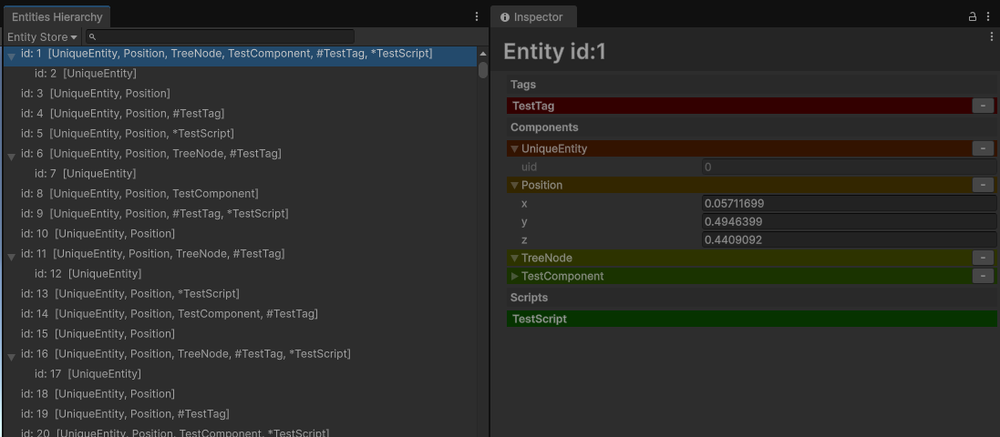

# Friflo.Engine.ECS Unity EntityVisualize
This library displays a list of structure [Friflo.Engine.ECS](https://github.com/friflo/Friflo.Engine.ECS) entities and their structure in the Unity Inspector.<br>
*Rewriting values ​​is not supported.

# Requirement
- Unity 2022.1 higher

# Dependency
- [Friflo.Engine.ECS](https://www.nuget.org/packages/Friflo.Engine.ECS/)

## Git Path (Unity Package Manager)
> https://github.com/kurobon-jp/FrifloECS.Unity.EntityVisualize.git?path=Assets/

## Usage 

### Register EntityStore
```csharp
public class Main : MonoBehaviour
{
    private void Start()
    {
        var entityStore = new EntityStore();
        ~
        EntityVisualizer.Register("MainEntityStore", entityStore);
    }
}
```

Window -> Friflo.ECS -> Entities Hierarchy<br>

